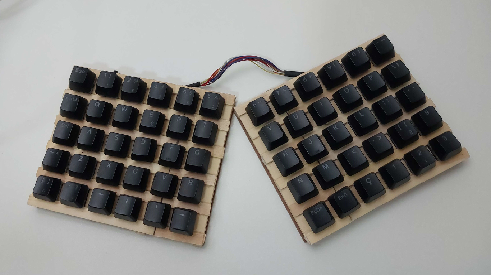
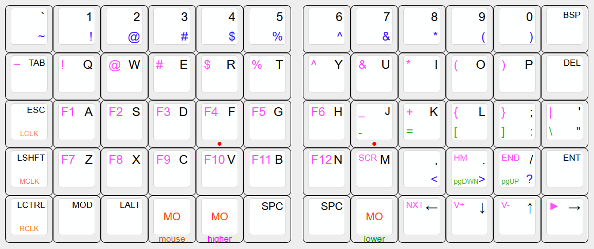
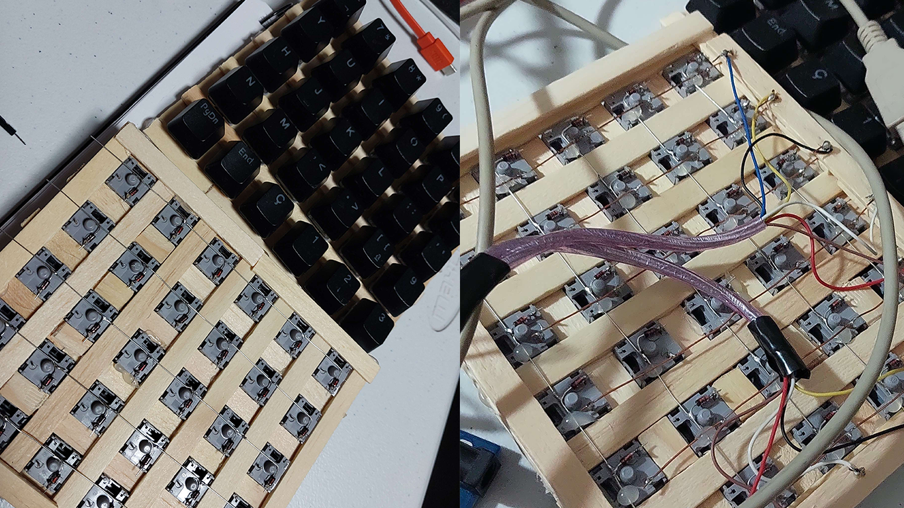

# POOR MAN'S NYQUIST
A split keyboard made of popsicle sticks, salvaged Outemu Blue switches and a Raspberry Pi Pico.




 Made in November 2023.

## Inspired by
https://matt3o.com/hand-wiring-a-custom-keyboard/  
https://www.reddit.com/r/MechanicalKeyboards/comments/mk9aqt/nyquist_ortholinear_split_keyboard_build/

# INSTALL QMK
- `sudo rm /usr/lib/python3.11/EXTERNALLY-MANAGED`
- `python3 -m pip install --user qmk`
- add `~/.local/bin` to PATH
- change directory to the desired install folder
- `qmk setup --home $PWD/qmk_firmware`

# BUILD AND UPDATE PM_NYQUIST
- copy `pm_nyquist` folder to `qmk_firmware/keyboards`
- `qmk compile -kb pm_nyquist -km default`
- uf2 file is located on `qmk_firmware/.build`
- plug in keyb holding boot button
- move uf2 file to directory

# GENERATING CHEATSHEET
http://www.keyboard-layout-editor.com/#/  
Paste on "raw data" tab:
```
[{c:"#ededed",t:"#FF00FF\n\n#000000\n0000FF",fa:[0,0,4,4]},"\n\n`\n~","\n\n1\n!","\n\n2\n@","\n\n3\n#","\n\n4\n$","\n\n5\n%",{x:0.25},"\n\n6\n^","\n\n7\n&","\n\n8\n*","\n\n9\n(","\n\n0\n)",{t:"#FF00FF\n\n#000000",fa:[0,0,2]},"\n\nBSP"],
[{fa:[4,0,2]},"~\n\nTAB",{fa:[4,0,4]},"!\n\nQ","@\n\nW","#\n\nE","$\n\nR","%\n\nT",{x:0.25},"^\n\nY","&\n\nU","*\n\nI","(\n\nO",")\n\nP",{fa:[4,0,2]},"\n\nDEL"],
[{t:"#FF00FF\n\n#000000\n\n\n\n\n\n\n\n#d45f00",fa:[4,0,2,0,0,0,0,0,0,0,1]},"\n\nESC\n\n\n\n\n\n\n\nLCLK",{t:"#FF00FF\n\n#000000",fa:[4,0,4]},"F1\n\nA","F2\n\nS","F3\n\nD",{t:"#FF00FF\n\n#000000\n\n#ff0000"},"F4\n\nF\n\n●",{t:"#FF00FF\n\n#000000"},"F5\n\nG",{x:0.25},"F6\n\nH",{t:"#FF00FF\n#009618\n#000000\n\n#ff0000",f:3},"_\n-\nJ\n\n●",{t:"#FF00FF\n#009618\n#000000",fa:[4,4,4]},"+\n=\nK","{\n[\nL",{t:"#FF00FF\n#009618\n#000000\n0000FF",fa:[4,4,4,4]},"}\n]\n;\n:","|\n\\\n'\n\""],
[{t:"#FF00FF\n\n#000000\n\n\n\n\n\n\n\n#d45f00",fa:[4,4,2,4,0,0,0,0,0,0,1]},"\n\nLSHFT\n\n\n\n\n\n\n\nMCLK",{t:"#FF00FF\n\n#000000",fa:[4,4,4]},"F7\n\nZ","F8\n\nX","F9\n\nC","F10\n\nV","F11\n\nB",{x:0.25},"F12\n\nN",{fa:[2,4,4]},"SCR\n\nM",{t:"#FF00FF\n\n#000000\n0000FF",fa:[2,4,4,4]},"\n\n,\n<",{t:"#FF00FF\n#009618\n#000000\n0000FF",fa:[2,1,4,4]},"HM\npgDWN\n.\n>","END\npgUP\n/\n?",{t:"#FF00FF\n\n#000000",fa:[2,1,2]},"\n\nENT"],
[{t:"#FF00FF\n\n#000000\n\n\n\n\n\n\n\n#d45f00",fa:[2,1,2,0,0,0,0,0,0,0,1]},"\n\nLCTRL\n\n\n\n\n\n\n\nRCLK",{t:"#FF00FF\n\n#000000"},"\n\nMOD","\n\nLALT",{t:"#ff0000\n\n\n\n#d45f00",a:7,f:3},"MO\n\n\n\nmouse",{t:"#ff0000\n\n\n\n#FF00FF",f:3},"MO\n\n\n\nhigher",{t:"#FF00FF\n\n#000000",a:4},"\n\nSPC",{x:0.25},"\n\nSPC",{t:"#ff0000\n\n\n\n#009618",a:7,f:3},"MO\n\n\n\nlower",{t:"#FF00FF\n\n#000000",a:4,fa:[2,1,4]},"NXT\n\n←","V+\n\n↓","V-\n\n↑",{fa:[0,1,4]},"►\n\n→"]
```

# OTHER INFO
- used 0-sixty as a starting point
- qmk version 1.1.2
- there is a known bug with rp2040-based keyboards [not waking up computers from S3 sleep](https://github.com/qmk/qmk_firmware/issues/19663)
